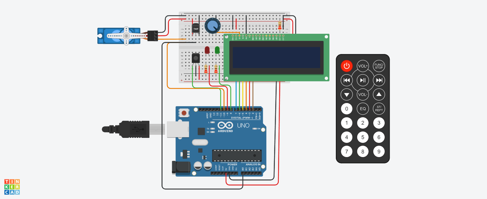

# Segundo-Parcial-SPD

# Diagrama esquemático del circuito
[Ver diagrama](ParcialSPD2/IMG/diagrama.pdf)

# Integrante
- Funtanillas, Belén

# Descripción
Este proyecto utiliza Arduino para diseñar un sistema de detección de incendios que puede detectar cambios de temperatura y activar un servo motor en caso de detectar uno. Además, muestra la temperatura actual y la estación del año en un display LCD.

## Componentes utilizados
- Arduino board
- Sensor de temperatura (LM35 o similar)
- Sensor de infrarrojos (IR)
- Display LCD (16x2 caracteres)
- Servo motor
- leds

## Librerías utilizadas
- IRremote: Para recibir señales del control remoto IR.
- LiquidCrystal: Para controlar el display LCD.
- Servo: Para controlar el servo motor.
  ~~~
  #include <IRremote.h>
  #include <LiquidCrystal.h>
  #include <Servo.h>
  ~~~
  
## Configuración de pines
- Sensor de temperatura: pinTemperatura = A0
- Sensor de infrarrojos: pinIR = 11
- LEDs: pinLED1 = 9, pinLED2 = 8
- Servo motor: pinServo = 10
- Display LCD: Utiliza los pines 7, 6, 5, 4, 3 y 2.

## Variables globales
- umbralTemperatura: Umbral de temperatura para detectar un incendio.
- incendioDetectado: Variable booleana para indicar si se ha detectado un incendio.
- sistemaActivado: Variable booleana para indicar si el sistema está activado.
- valor_IR: Almacena el valor recibido del control remoto.

## Configuración inicial
- Se inicia la comunicación serial para imprimir información.
- Se inicializa el receptor IR y se desactiva la retroalimentación del LED.
- Se inicializa el display LCD con una configuración de 16x2 caracteres.
- Se conecta el servo motor al pin especificado y se establece el ángulo inicial.
- Se configuran los pines de los LEDs como salidas y se apaga el LED1.
~~~
void setup() {
  Serial.begin(9600);
  IrReceiver.begin(pinIR, DISABLE_LED_FEEDBACK);

  // Inicialización del display LCD
  lcd.begin(16, 2);

  // Inicialización del servo motor
  servo.attach(pinServo, 500, 2500);
  servo.write(anguloInicial);  // Establecer el ángulo inicial del servo

  // Configuración de los pines de los LEDs
  pinMode(pinLED1, OUTPUT);
  pinMode(pinLED2, OUTPUT);
  digitalWrite(pinLED1, LOW);  // Apagar el LED1 inicialmente
}
~~~

## Loop principal
En el loop principal se realiza lo siguiente:

- Se lee la temperatura actual mediante el sensor y se convierte a grados Celsius.
- Si el control remoto está activado, se verifica si se ha detectado un incendio y se procesan las señales del control remoto.
- Si el sistema está desactivado, se muestra la temperatura actual en el display LCD.
- Se repite este proceso en cada iteración del loop.

~~~
void loop() {
  
float voltaje = analogRead(A0) * (5.0 / 1023.0);  
float temperatura = (voltaje - 0.5) * 100.0;  // Convertir el voltaje a temperatura en grados Celsius
  
  if(controlRemoto == true) {
  
           incendioDetectado = detectarIncendio(umbralTemperatura, temperatura); 
           if (IrReceiver.decode()) //detecta si el control fue accionado 
            {	
             valor_IR = IrReceiver.decodedIRData.decodedRawData;//campuramos el valor del control en una variable 
             Serial.println(valor_IR);
             sistemaActivado = procesarControlRemoto(valor_IR, &umbralTemperatura, sistemaActivado);

             IrReceiver.resume();
           }//fin del if

            if (!sistemaActivado)
            {
              escribirLCD(0,1, "Temp: ");
              lcd.print(temperatura);
            }
  }
}

~~~

### `procesarControlRemoto`
Esta función se encarga de procesar las señales recibidas del control remoto y realizar las acciones correspondientes. Recibe el valor del control remoto, la dirección de memoria de la temperatura máxima y el estado del sistema como parámetros.
~~~
bool procesarControlRemoto(long valorIR, float* temperatura_maxima, bool sistemaActivado) {
	lcd.clear();
    switch (valorIR) {
      case botonPower:
        if (sistemaActivado) {
          escribirLCD(0, 0, "Sistema activado");
        } else {
          escribirLCD(0, 0, "Sistema apagado"); 
        }
      sistemaActivado = !sistemaActivado;
        break;
      case botonEstacion1:
       		lcd.clear();
          escribirLCD(0, 0, "Invierno");
      		*temperatura_maxima = 40;
        
        break;
      case botonEstacion2:
        	lcd.clear();
          escribirLCD(0, 0, "Otonio");
       		*temperatura_maxima = 45;
        break;
      case botonEstacion3:
       	lcd.clear();
          escribirLCD(0, 0, "Primavera");
       		*temperatura_maxima = 50;
        break;
      case botonEstacion4:
       	lcd.clear();
          escribirLCD(0, 0, "Verano");
      		*temperatura_maxima = 60;
       
        break;
    }
  
  delay(1000);
  
  return sistemaActivado;
}
~~~

### `escribirLCD`
Esta función recibe una columna, fila y un mensaje como parámetros, y se encarga de escribir el mensaje en la posición especificada del display LCD.
~~~
void escribirLCD(int columna, int fila, const char* mensaje) {
  lcd.setCursor(columna, fila);  // Establece la posición del cursor en el LCD
  lcd.print(mensaje);  // Escribe el mensaje en el LCD
}
~~~

### `encenderServo`
Esta función recibe un ángulo como parámetro y se encarga de mover el servo motor a ese ángulo.
~~~
void encenderServo(int angulo) {
  servo.write(angulo);  // Mover el servo 
}
~~~

### `detectarIncendio`
Esta función recibe la temperatura máxima y la temperatura actual como parámetros, y verifica si se ha detectado un incendio. Si la temperatura actual supera el umbral, se enciende el servo motor, se activa el LED1 y se desactiva el LED2. En caso contrario, se apaga el servo motor, se activa el LED2 y se desactiva el LED1. Devuelve un valor booleano indicando si se ha detectado un incendio.
~~~
bool detectarIncendio(float temperatura_maxima, float temperatura_actual)
{
  bool incendioDetectado;
  if(temperatura_actual >= temperatura_maxima)
  {
    incendioDetectado = true; 
    encenderServo(90);
    digitalWrite(pinLED1, HIGH);
    digitalWrite(pinLED2, LOW);
    
  } else {
    incendioDetectado = false;
    encenderServo(0);
    digitalWrite(pinLED1, LOW);
    digitalWrite(pinLED2, HIGH);
  }
  return incendioDetectado;
}

# Link al proyecto: 
[ver proyecto](https://www.tinkercad.com/things/9sF6zoYs6U3-sistema-de-incendio-funtanillas-belen/editel?sharecode=tYOsXitgDvipAEMznWeTKyGyhdqaGUN8Fqw_sZU9nK8)
~~~
---
### Fuentes
- [Consejos para documentar](https://www.sohamkamani.com/how-to-write-good-documentation/#architecture-documentation).

- [Lenguaje Markdown](https://markdown.es/sintaxis-markdown/#linkauto).

- [Markdown Cheatsheet](https://github.com/adam-p/markdown-here/wiki/Markdown-Cheatsheet).

- [Tutorial](https://www.youtube.com/watch?v=oxaH9CFpeEE).

- [Emojis](https://gist.github.com/rxaviers/7360908).

---

